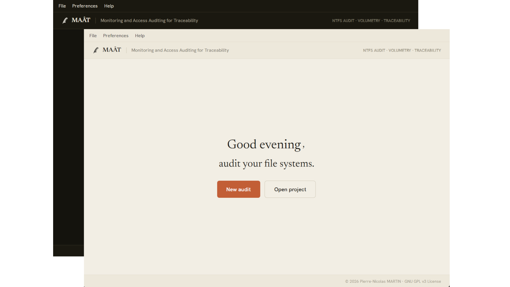
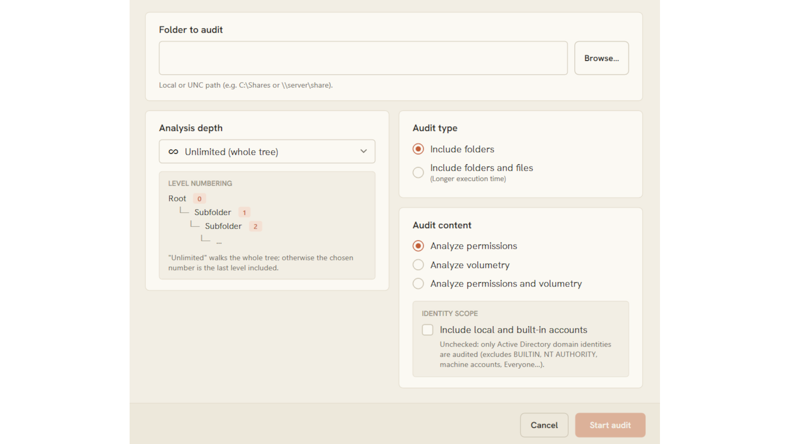
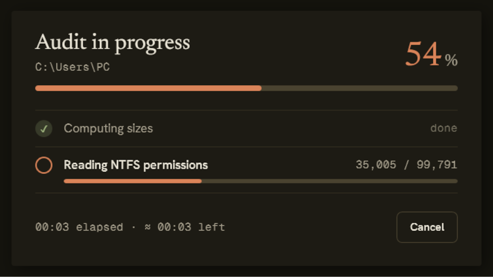
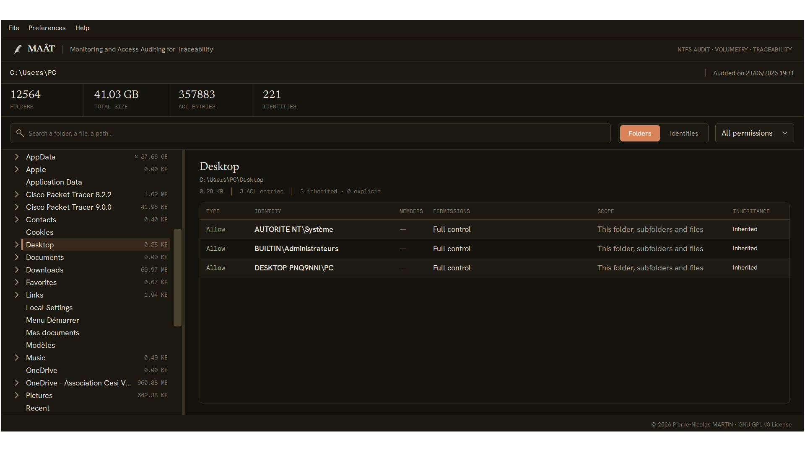
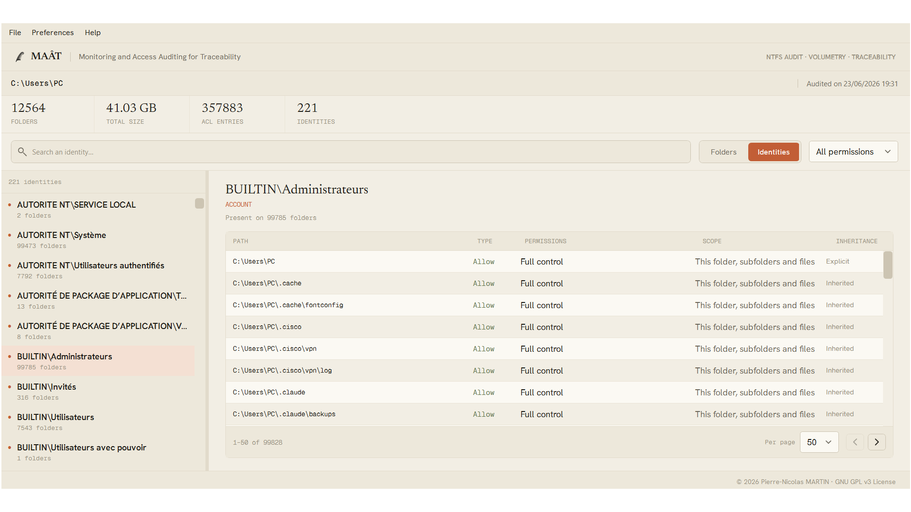
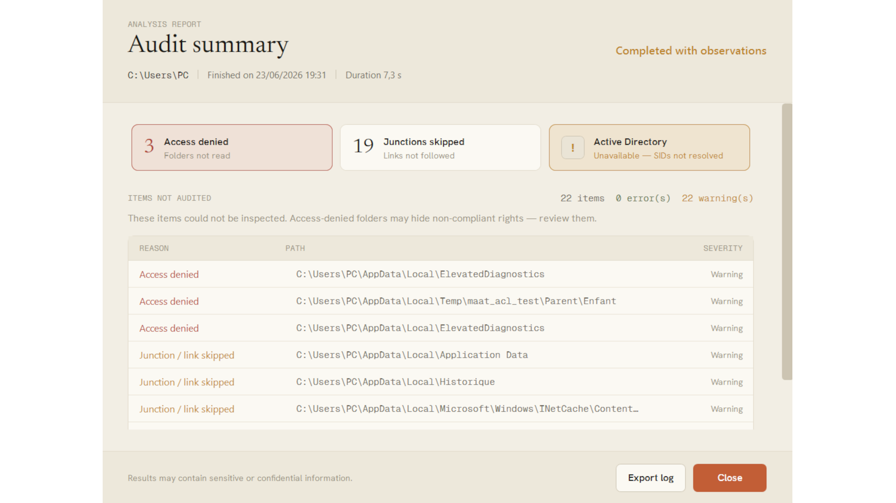
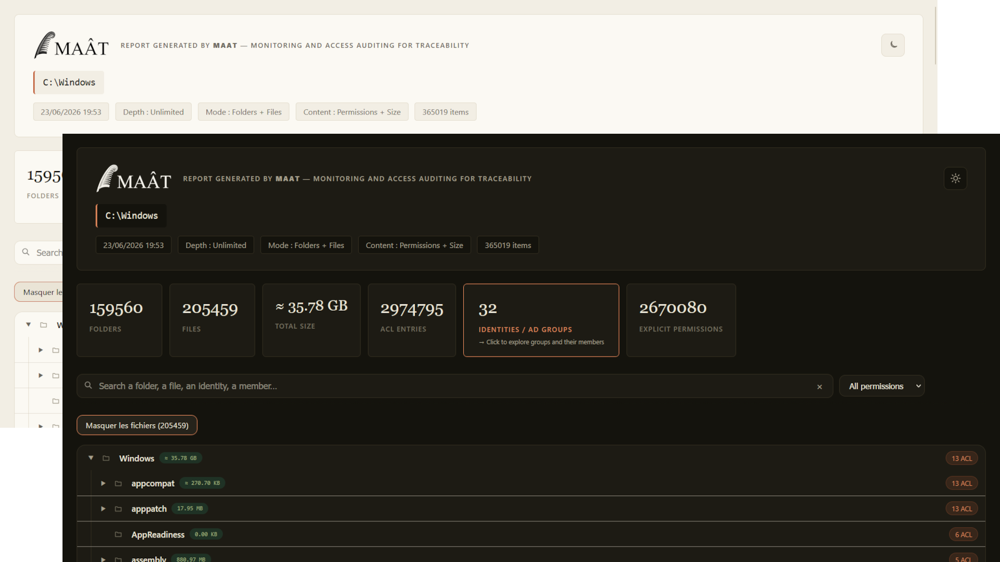
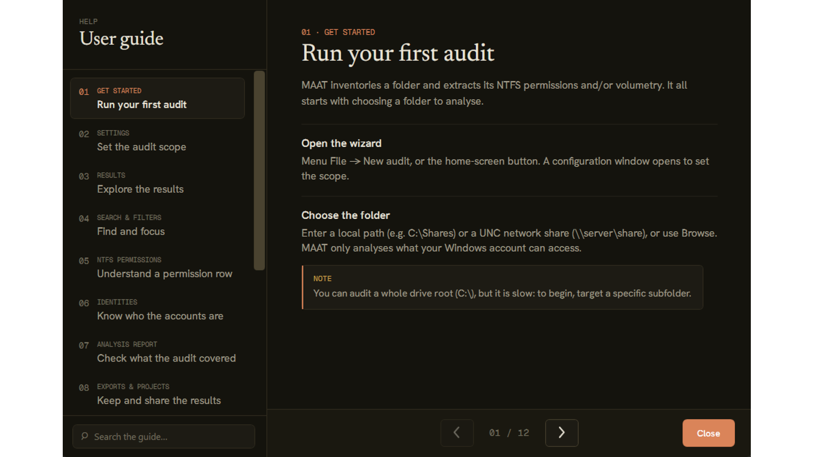

# MAAT — Monitoring and Access Auditing for Traceability

[](README.md)
[](README.fr.md)

**MAAT** is a Windows file-system auditing tool. It inventories a directory tree, reads
the **NTFS permissions (ACLs)** of every item, computes **sizes** and resolves
**Active Directory groups** (nested memberships), then presents everything in an
interactive interface and exportable reports.

> Status: version 1.1.0 — feature-complete.
> License: **GNU GPL v3**.

---

## Overview

| <br>**Main window** (light & dark themes) | <br>**New audit** configuration |
|:--:|:--:|
| <br>**Real-time progress**, with estimated time remaining | <br>**Results — Folders view**: tree + permissions detail |
| <br>**Results — Identities view**: locations & members | <br>**Audit analysis report** |
| <br>**Interactive HTML report** (standalone) | <br>**Built-in user guide** |

### Icons

<p>
  &nbsp;&nbsp;&nbsp;&nbsp;
  
</p>

Application icon · `.maat` project-file icon (both featuring Maat's feather).

---

## Download

The latest version is published in the
[**Releases**](https://github.com/pierrenicolasmartin/MAAT/releases/latest). Two formats are
available — an MSI installer and a no-install portable package:

| Artifact | Description | VirusTotal |
|---|---|:--:|
| **`MAAT-1.1.0-x64.msi`** | Installer (Windows x64, .NET 8 runtime included) | [](https://www.virustotal.com/gui/file/01a2196ce660e7a2db20905d73f913bc426b474e2e6ebe457b8aa1572e330c73) |
| **`MAAT-1.1.0-portable-x64.zip`** | Portable package (no installation) | [](https://www.virustotal.com/gui/file/0e94dd116ba9f165100e381b68f2ebd98f2684ac41b45e1938c73b3f128a7755) |
| &nbsp;&nbsp;└ **`MAAT.exe`** | Portable executable (inside the ZIP) | [](https://www.virustotal.com/gui/file/f6a0297a770c7206b270bc0bfcce22edf36a5c93d4563e26920c77b8030e34a7) |

Integrity — SHA-256:

```
01a2196ce660e7a2db20905d73f913bc426b474e2e6ebe457b8aa1572e330c73  MAAT-1.1.0-x64.msi
0e94dd116ba9f165100e381b68f2ebd98f2684ac41b45e1938c73b3f128a7755  MAAT-1.1.0-portable-x64.zip
f6a0297a770c7206b270bc0bfcce22edf36a5c93d4563e26920c77b8030e34a7  MAAT.exe
```

---

## Features

- **NTFS permissions audit**: explicit and inherited ACEs, distinction between
  Allow / Deny, scope, and inheritance source.
- **Size audit**: bottom-up computation, partial-size marking (`≈`).
- **Active Directory resolution** (optional): recursive group expansion with cycle
  detection; "(via *group*)" annotation of indirect membership. Graceful degradation
  off-domain, with no dependency on the RSAT module.
- **Modern interface** (WPF, MVVM): virtualized tree, search, filters by permission
  type and by identity, light / dark themes, two languages (EN / FR).
- **Exports**: CSV and a **standalone interactive HTML report** (a single file,
  openable in any browser, with no external dependency).
- **Streaming engine**: native enumeration, parallel batched ACL reading, bounded
  RAM even on very deep volumes (full audit of a system drive).
- **`.maat` project format**: compressed SQLite database (gzip), reopenable, holding
  results, parameters and metadata.

## Privacy

Audit reports contain sensitive data (permissions, identities). By design:

- the working database is created in `%TEMP%` then **destroyed on exit** if the
  project was not explicitly saved;
- a saved `.maat` is a **separate copy**, under the user's responsibility;
- `.maat` / `.maatdb` files are excluded from the repository (`.gitignore`): never
  commit real audit data.

## Requirements

- Windows 10 / 11 (NTFS ACLs and the Active Directory API are Windows-specific).
- [.NET 8 SDK](https://dotnet.microsoft.com/) to build from source.
- AD resolution requires a domain-joined machine; otherwise it is simply disabled.

## Build

```sh
dotnet build MAAT.sln -c Release
```

Self-contained single-file executable:

```sh
dotnet publish src/MAAT.App -p:PublishProfile=win-x64-selfcontained -c Release
```

MSI installer (requires [WiX Toolset v5](https://wixtoolset.org/)):

```sh
cd installer
wix build Package.wxs -ext WixToolset.UI.wixext -o MAAT-1.1.0-x64.msi
```

Portable package (no installation, settings stored next to the executable):

```sh
pwsh portable/build.ps1
```

## Repository structure

| Path | Role |
|---|---|
| `src/MAAT.Core` | Audit engine (enumeration, ACLs, AD, sizes) — no UI dependency. |
| `src/MAAT.Storage` | SQLite persistence, `.maat` project format. |
| `src/MAAT.Export` | CSV and HTML exports. |
| `src/MAAT.App` | WPF application (MVVM, themes, views). |
| `installer/` | WiX v5 MSI project. |
| `portable/` | Portable-package build script. |
| `ressources/` | Icons, logos, fonts (under the OFL license). |

## Architecture

The application follows a strict dependency direction:

```
MAAT.App ──► MAAT.Export ──► MAAT.Core
        └──► MAAT.Storage ─►
```

The engine (`StreamingAuditEngine`) emits each item on the fly to a SQLite *sink*;
the UI reads the database with pagination for a virtualized tree, and the exports
consume the database in streaming, without ever materializing the whole set in memory.

## Changelog

### 1.1.0
- Various bug fixes and optimizations.
- New interface for audit results.
- Interface refinements.

### 1.0.0
- Initial release.

## License

This program is free software, distributed under the terms of the
**GNU General Public License v3** — see [LICENSE](LICENSE).

Third-party components (.NET runtime, SQLite, the Hanken Grotesk / Newsreader / Geist Mono
fonts) and their licenses are described in [THIRD-PARTY-NOTICES.txt](THIRD-PARTY-NOTICES.txt).

Copyright (C) 2026 Pierre-Nicolas MARTIN.

---

<sub>🤖 This project was designed and built with the assistance of Claude (Anthropic).</sub>
