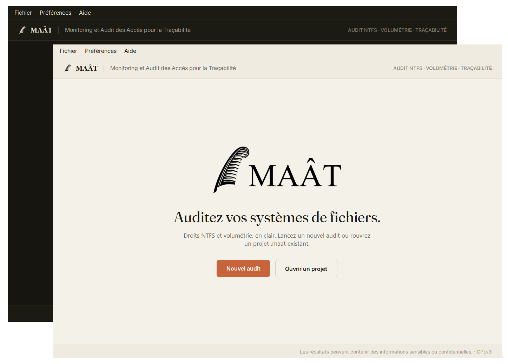
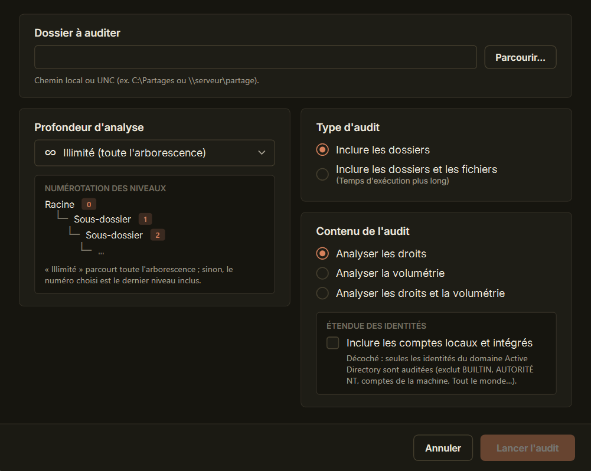
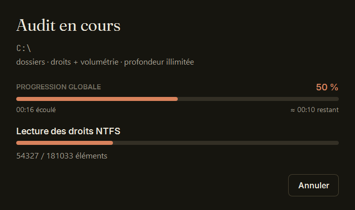
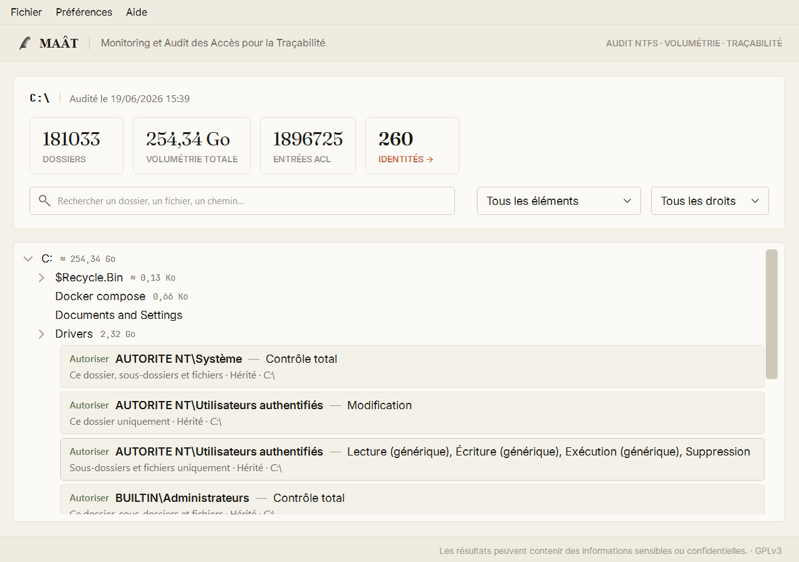

# MAAT — Monitoring et Audit des Accès pour la Traçabilité

**MAAT** est un logiciel Windows d'audit de systèmes de fichiers. Il inventorie une
arborescence, lit les **droits NTFS (ACL)** de chaque élément, calcule les **tailles**
et résout les **groupes Active Directory** (appartenances imbriquées), puis restitue
le tout dans une interface interactive et des rapports exportables.

> Statut : version 1.0 — fonctionnellement complète.
> Licence : **GNU GPL v3**.

---

## Aperçu

| <br>**Écran d'accueil** (thèmes clair et sombre) | <br>**Configuration** d'un nouvel audit |
|:--:|:--:|
| <br>**Progression** en temps réel, avec estimation du temps restant | <br>**Résultats** : arbre virtualisé et ACL dépliées en ligne |

### Icônes

<p>
  &nbsp;&nbsp;&nbsp;&nbsp;
  
</p>

Icône de l'application · icône des fichiers projet `.maat` (toutes deux à la plume de Maât).

---

## Téléchargement

La dernière version est publiée dans les
[**Releases**](https://github.com/pierrenicolasmartin/MAAT/releases/latest) : téléchargez et
exécutez **`MAAT-1.0.0-x64.msi`** (Windows x64, runtime .NET 8 inclus).

[](https://www.virustotal.com/gui/file/e079a42a6500acdd5202a3a5911a24bd6fe419c3df752890e49231ef8e13d223)

Intégrité du MSI — SHA-256 :

```
e079a42a6500acdd5202a3a5911a24bd6fe419c3df752890e49231ef8e13d223
```

---

## Fonctionnalités

- **Audit des droits NTFS** : ACE explicites et héritées, traduction française des
  droits et portées, distinction Autoriser / Refuser, source de l'héritage.
- **Audit des tailles** : calcul bottom-up, marquage des tailles partielles (`≈`).
- **Résolution Active Directory** (optionnelle) : développement récursif des groupes
  avec détection de cycles ; annotation « (via *groupe*) » de l'appartenance indirecte.
  Dégradation propre hors domaine, sans dépendance au module RSAT.
- **Interface moderne** (WPF, MVVM) : arbre virtualisé, recherche, filtres par type
  de droit et par identité, thèmes clair / sombre, deux langues (FR / EN).
- **Exports** : CSV et **rapport HTML interactif autonome** (un seul fichier, ouvrable
  dans n'importe quel navigateur, sans dépendance externe).
- **Moteur en streaming** : énumération native, lecture ACL parallèle par lots,
  RAM bornée même sur des volumes très profonds (audit complet d'un disque système).
- **Format projet `.maat`** : base SQLite compressée (gzip), rouvrable, contenant
  résultats, paramètres et métadonnées.

## Confidentialité

Les rapports d'audit contiennent des données sensibles (droits, identités). Par
conception :

- la base de travail est créée dans `%TEMP%` puis **détruite à la fermeture** si le
  projet n'a pas été explicitement enregistré ;
- un `.maat` enregistré est une **copie distincte**, à la charge de l'utilisateur ;
- les fichiers `.maat` / `.maatdb` sont exclus du dépôt (`.gitignore`) : ne jamais
  committer de données d'audit réelles.

## Prérequis

- Windows 10 / 11 (les ACL NTFS et l'API Active Directory sont propres à Windows).
- [.NET 8 SDK](https://dotnet.microsoft.com/) pour compiler depuis les sources.
- La résolution AD nécessite une machine jointe à un domaine ; sinon elle est
  simplement désactivée.

## Compilation

```sh
dotnet build MAAT.sln -c Release
```

Exécutable autonome (single-file, self-contained) :

```sh
dotnet publish src/MAAT.App -p:PublishProfile=win-x64-selfcontained -c Release
```

Installeur MSI (nécessite [WiX Toolset v5](https://wixtoolset.org/)) :

```sh
cd installer
wix build Package.wxs -ext WixToolset.UI.wixext -o MAAT-1.0.0-x64.msi
```

## Structure du dépôt

| Chemin | Rôle |
|---|---|
| `src/MAAT.Core` | Moteur d'audit (énumération, ACL, AD, tailles) — sans dépendance UI. |
| `src/MAAT.Storage` | Persistance SQLite, format projet `.maat`. |
| `src/MAAT.Export` | Exports CSV et HTML. |
| `src/MAAT.App` | Application WPF (MVVM, thèmes, vues). |
| `installer/` | Projet MSI WiX v5. |
| `ressources/` | Icônes, logos, polices (sous licence OFL). |

## Architecture

L'application est découpée selon une direction de dépendances stricte :

```
MAAT.App ──► MAAT.Export ──► MAAT.Core
        └──► MAAT.Storage ─►
```

Le moteur (`StreamingAuditEngine`) émet chaque élément au fil de l'eau vers un *sink*
SQLite ; l'interface lit la base en pagination pour un arbre virtualisé, et les exports
consomment la base en streaming, sans jamais matérialiser l'ensemble en mémoire.

## Licence

Ce programme est un logiciel libre, distribué sous les termes de la
**GNU General Public License v3** — voir [LICENSE](LICENSE).

Les composants tiers (runtime .NET, SQLite, polices Inter / Fraunces / JetBrains Mono)
et leurs licences sont décrits dans [THIRD-PARTY-NOTICES.txt](THIRD-PARTY-NOTICES.txt).

Copyright (C) 2026 Pierre-Nicolas MARTIN.
