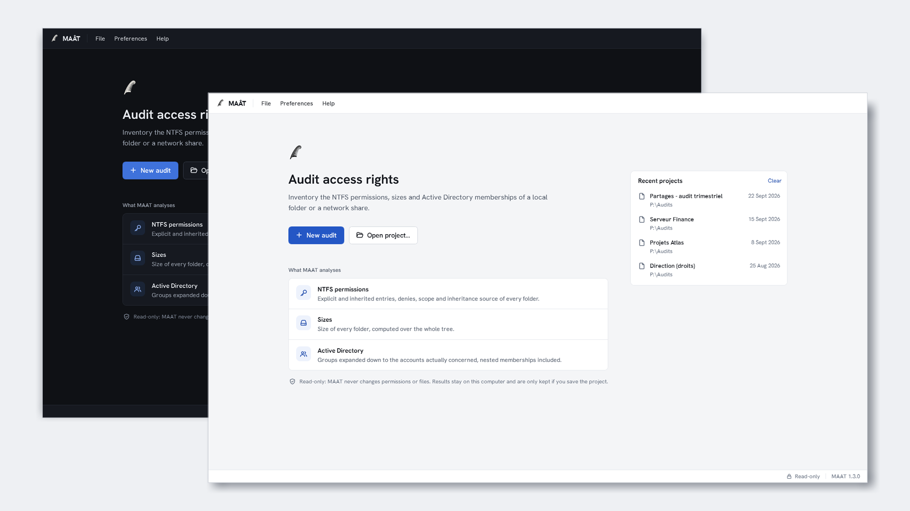
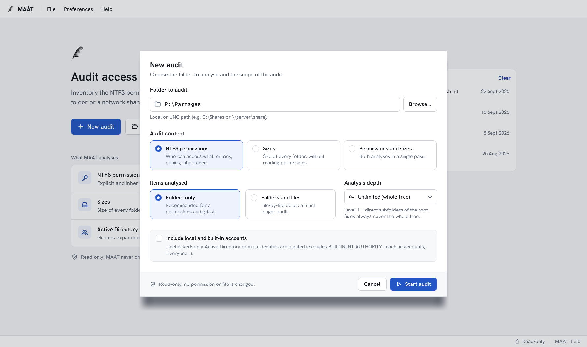
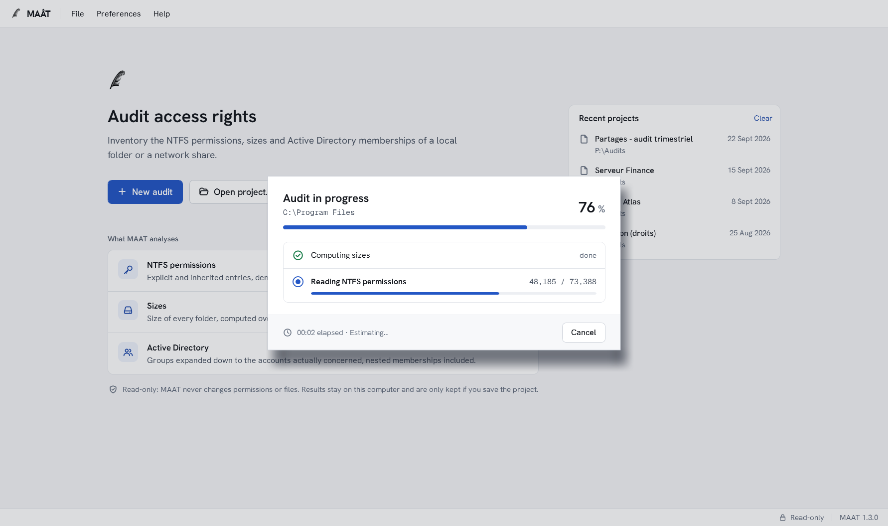
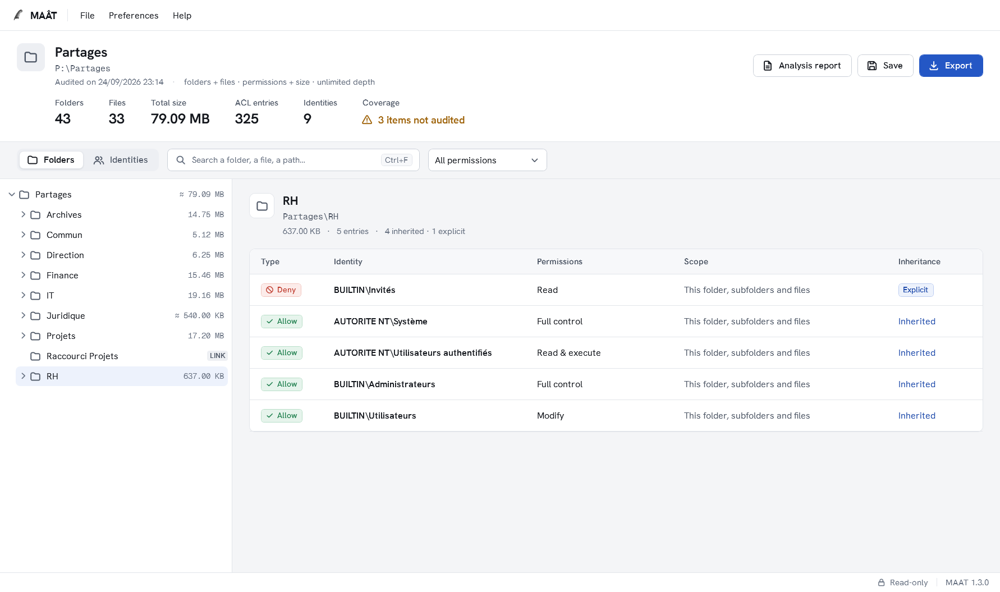
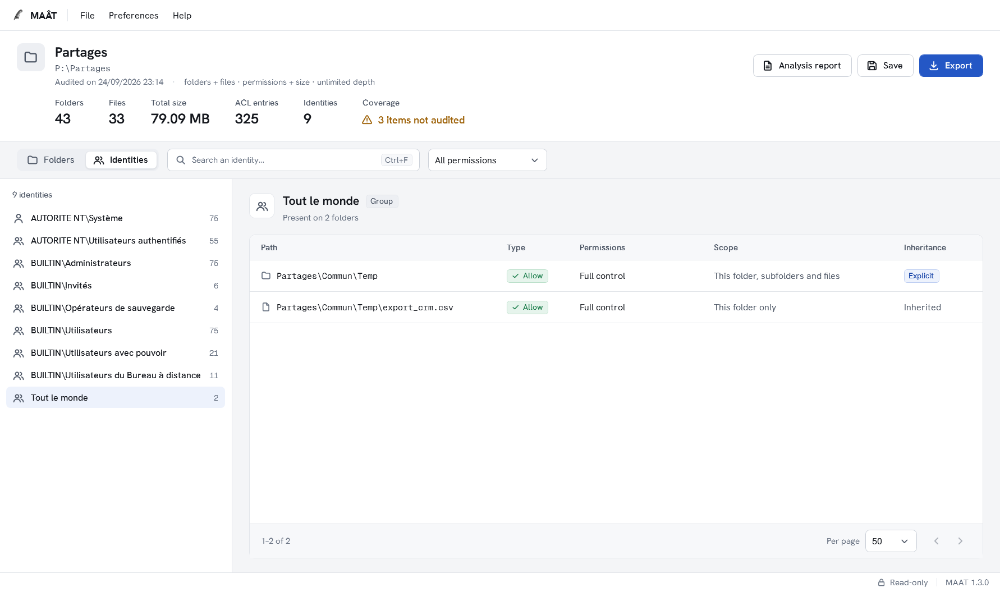
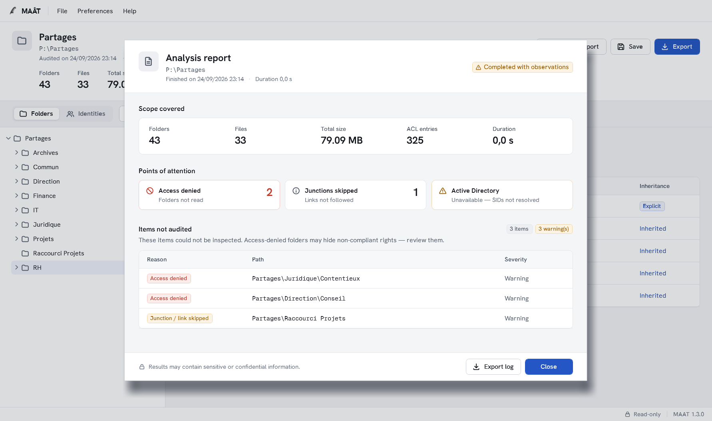
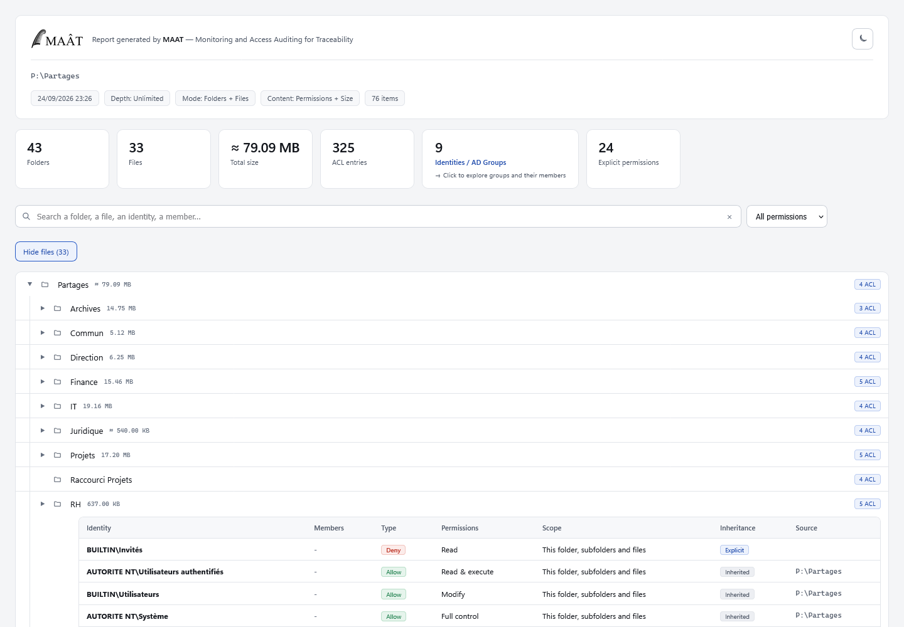
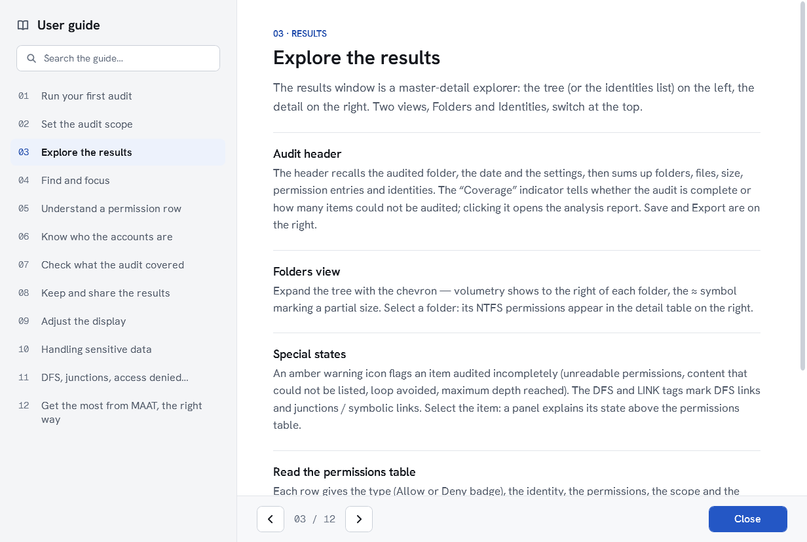

# MAAT — Monitoring and Access Auditing for Traceability

[](README.md)
[](README.fr.md)

**MAAT** is a Windows file-system auditing tool. It inventories a directory tree, reads
the **NTFS permissions (ACLs)** of every item, computes **sizes** and resolves
**Active Directory groups** (nested memberships), then presents everything in an
interactive interface and exportable reports.

> Status: version 1.3.0 — feature-complete.
> License: **GNU GPL v3**.

---

## Overview

| <br>**Start screen** (light & dark themes), recent projects | <br>**New audit** configuration |
|:--:|:--:|
| <br>**Real-time progress**, with estimated time remaining | <br>**Results — Folders view**: key figures, coverage, tree + permissions |
| <br>**Results — Identities view**: locations & members | <br>**Analysis report**: scope covered, points of attention, items not audited |
| <br>**Interactive HTML report** (standalone) | <br>**Built-in user guide** |

### Icons

<p>
  &nbsp;&nbsp;&nbsp;&nbsp;
  
</p>

Application icon · `.maat` project-file icon (both featuring Maat's feather).

---

## Download

The latest version is published in the
[**Releases**](https://github.com/pierrenicolasmartin/MAAT/releases/latest). Two formats are
available — an MSI installer and a no-install portable package:

| Artifact | Description | VirusTotal |
|---|---|:--:|
| **`MAAT-1.2.0-x64.msi`** | Installer (Windows x64, .NET 8 runtime included) | [](https://www.virustotal.com/gui/file/13baa2698f6020c1df8d748c9846ceb05d3086c77a719c92a1c35f472d73e6aa) |
| **`MAAT-1.2.0-portable-x64.zip`** | Portable package (no installation) | [](https://www.virustotal.com/gui/file/d2e202cbbf46aa08b73652cdba57a713432dbc4c3bbc831fae08bcc7778f477b) |
| &nbsp;&nbsp;└ **`MAAT.exe`** | Portable executable (inside the ZIP) | [](https://www.virustotal.com/gui/file/78e2bd2922ac5c5cdeff071b8a15c06c9f6a38d17dc7494627d0c6075bfcb35c) |

Integrity — SHA-256:

```
13baa2698f6020c1df8d748c9846ceb05d3086c77a719c92a1c35f472d73e6aa  MAAT-1.2.0-x64.msi
d2e202cbbf46aa08b73652cdba57a713432dbc4c3bbc831fae08bcc7778f477b  MAAT-1.2.0-portable-x64.zip
78e2bd2922ac5c5cdeff071b8a15c06c9f6a38d17dc7494627d0c6075bfcb35c  MAAT.exe
```

---

## Features

- **NTFS permissions audit**: explicit and inherited ACEs, distinction between
  Allow / Deny, scope, and inheritance source.
- **Size audit**: bottom-up computation, partial-size marking (`≈`).
- **Active Directory resolution** (optional): recursive group expansion with cycle
  detection; "(via *group*)" annotation of indirect membership. Graceful degradation
  off-domain, with no dependency on the RSAT module.
- **Professional interface** (WPF, MVVM): consistent design system, virtualized tree,
  search, filters by permission type and by identity, light / dark themes following
  Windows, keyboard shortcuts, two languages (EN / FR).
- **Exports**: CSV and a **standalone interactive HTML report** (a single file,
  openable in any browser, with no external dependency).
- **Streaming engine**: native enumeration, parallel batched ACL reading, bounded
  RAM even on very deep volumes (full audit of a system drive).
- **Reliable traversal**: DFS namespaces followed to their targets, long paths
  (> 260 characters), loop and depth guards, access-based enumeration (ABE) detection;
  items that could not be fully audited are kept and flagged, never silently dropped.
- **`.maat` project format**: compressed SQLite database (gzip), reopenable, holding
  results, parameters and metadata.

## Privacy

Audit reports contain sensitive data (permissions, identities). By design:

- the working database is created in `%TEMP%` then **destroyed on exit** if the
  project was not explicitly saved;
- a saved `.maat` is a **separate copy**, under the user's responsibility;
- `.maat` / `.maatdb` files are excluded from the repository (`.gitignore`): never
  commit real audit data.

## Requirements

- Windows 10 / 11 (NTFS ACLs and the Active Directory API are Windows-specific).
- [.NET 8 SDK](https://dotnet.microsoft.com/) to build from source.
- AD resolution requires a domain-joined machine; otherwise it is simply disabled.

## Build

```sh
dotnet build MAAT.sln -c Release
```

Self-contained single-file executable:

```sh
dotnet publish src/MAAT.App -p:PublishProfile=win-x64-selfcontained -c Release
```

MSI installer (requires [WiX Toolset v5](https://wixtoolset.org/)):

```sh
cd installer
wix build Package.wxs -ext WixToolset.UI.wixext -o MAAT-1.3.0-x64.msi
```

Portable package (no installation, settings stored next to the executable):

```sh
pwsh portable/build.ps1
```

## Repository structure

| Path | Role |
|---|---|
| `src/MAAT.Core` | Audit engine (enumeration, ACLs, AD, sizes) — no UI dependency. |
| `src/MAAT.Storage` | SQLite persistence, `.maat` project format. |
| `src/MAAT.Export` | CSV and HTML exports. |
| `src/MAAT.App` | WPF application (MVVM, themes, views). |
| `installer/` | WiX v5 MSI project. |
| `portable/` | Portable-package build script. |
| `ressources/` | Icons, logos, fonts (under the OFL license). |

## Architecture

The application follows a strict dependency direction:

```
MAAT.App ──► MAAT.Export ──► MAAT.Core
        └──► MAAT.Storage ─►
```

The engine (`StreamingAuditEngine`) emits each item on the fly to a SQLite *sink*;
the UI reads the database with pagination for a virtualized tree, and the exports
consume the database in streaming, without ever materializing the whole set in memory.

## Changelog

### 1.3.0
- **Redesigned interface**: a new design system — cool neutral palette with a single
  accent, one typeface for the whole interface, vector icons, consistent components,
  WCAG AA contrast; light and dark themes, with a Windows title bar that follows the theme.
- **Start screen**: what MAAT analyses, read-only commitment, recent projects.
- **Results explorer**: audit header with key figures and a **coverage** indicator
  (complete audit / items not audited), Save and Export buttons, clearer permissions
  table (Allow / Deny badges, explicit rights highlighted), paths relative to the audited
  root, more precise search.
- **Analysis report**: scope covered, points of attention, items not audited — can be
  reopened at any time, including for a saved project.
- **Keyboard shortcuts**: Ctrl+N, Ctrl+O, Ctrl+S, Ctrl+F, F1.
- **HTML report** aligned with the new design (light / dark).
- Serif font removed: a lighter package.

### 1.2.0
- **More reliable audits**: DFS namespaces followed transparently to their targets;
  automatic retry of transient network errors; loop protection and safety depth limit;
  long paths (> 260 characters) now also on network shares; access-based enumeration
  (ABE) detected on shares.
- **Nothing silently dropped**: items whose permissions or content cannot be read stay
  in the tree and are flagged (explorer, HTML report, CSV); inheritance sources above
  the audited root are resolved.
- **Performance**: faster native enumeration and permission parsing with much lower
  memory use; instant expansion of very large folders; faster identity lookups.
- **Interface**: item states in the explorer (amber dot, DFS / LINK tags, explanatory
  panels), files counter, thousands separators, new tiles in the analysis report
  (DFS links, loops avoided, ABE), updated user guide.
- `.maat` projects from earlier versions open unchanged (automatic migration).
- MSI: new product code, so the installer upgrades an existing installation in place.

### 1.1.0
- Various bug fixes and optimizations.
- New interface for audit results.
- Interface refinements.

### 1.0.0
- Initial release.

## License

This program is free software, distributed under the terms of the
**GNU General Public License v3** — see [LICENSE](LICENSE).

Third-party components (.NET runtime, SQLite, the Hanken Grotesk / Geist Mono
fonts) and their licenses are described in [THIRD-PARTY-NOTICES.txt](THIRD-PARTY-NOTICES.txt).

Copyright (C) 2026 Pierre-Nicolas MARTIN.

---

<sub>🤖 This project was designed and built with the assistance of Claude (Anthropic).</sub>
